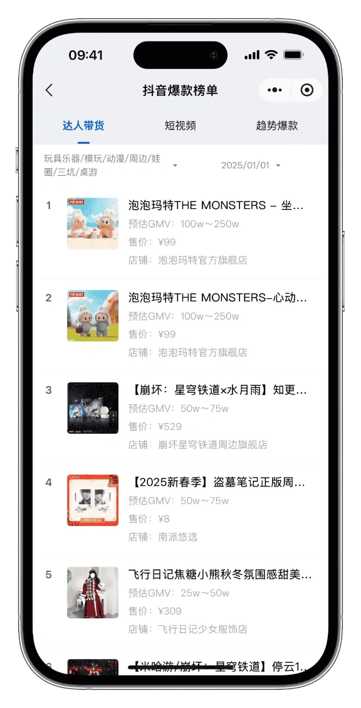
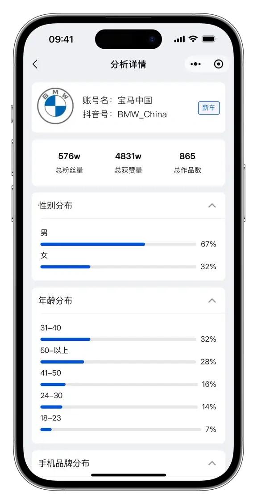

# Douyin_ec_data

抖音电商数据服务，提供分行业 Top X 商品基础数据和销量数据，支持小程序查询和 API 接口调用。
### 关键词
抖音数据，抖音数据分析，抖音数据查询，抖音数据分析平台，抖音数据查询平台，抖音后台数据，抖音数据分析工具，抖音账号分析，抖音数据平台，抖音直播数据，抖音电商数据，抖音短视频数据

（免费版本的 考古家、蝉妈妈、飞瓜数据...）

## 目录
- [产品介绍](#产品介绍)
  - [C端产品](#c端产品)
  - [B端接口](#b端接口)
- [API 文档](#api-文档)
  - [接口示例](#接口示例)
  - [字段说明](#字段说明)

## 产品介绍

### C端产品
- 微信小程序：搜索「巨有量AI电商助手」
- 官网：[www.oceanflow.top](https://www.oceanflow.top/)


| 小程首页 | 爆单日历 | 电商榜单 | 受众分析 | 更多功能 |
| ------ | ------ | ------ | ------ | ------ |
|  |  |  |  | ... |
### B端接口
提供抖音电商平台商品数据查询服务，支持以下功能：
- 商品列表查询
- 商品详情查询
- 销量数据分析

接口申请及商务合作请联系：runyuweng@163.com

## API 文档

### 接口示例
```json
{
  "_id": "",
  "author_list": [
    {
      "aweme_id": "",
      "image": "https://p3.douyinpic.com/aweme/100x100/aweme-avatar/tos-cn-avt-0015_0f07a07fa323885a338805ed2cd7a3c9.jpeg?from=3067671334",
      "nickname": ""
    }
  ],
  "begin_date": "2025-03-02",
  "brand_type": 0,
  "category_id": "20019",
  "end_date": "2025-03-02",
  "id": "",
  "image_url": "https://p3-aio.ecombdimg.com/obj/ecom-shop-material/jpeg_m_0a99534207110ad0a5ffb37d8e47f921_sx_1052415_www1200-1200",
  "is_follow": false,
  "leaf_category_id": 34389,
  "name": "",
  "new_pay_amt": {
    "value_range": [
      {
        "unit": "price",
        "value": 25000000
      },
      {
        "unit": "price",
        "value": 50000000
      }
    ]
  },
  "newly_on_ranking": false,
  "page_no": "1",
  "page_size": "10",
  "price_bin": "¥999-¥999",
  "product_click_cnt": {
    "value_range": [
      {
        "unit": "number",
        "value": 5000
      },
      {
        "unit": "number",
        "value": 7500
      }
    ]
  },
  "product_detail_h5_url": "https://haohuo.jinritemai.com/ecommerce/trade/detail/index.html?id=3738302600051818881&origin_type=pc_compass_manage",
  "rank": 1,
  "rank_change": 0,
  "rank_data_type": "1",
  "second_category_id": 0,
  "shop_list": [
    {
      "author_info": {
        "author_id": "98869298261",
        "author_logo": "https://p3.douyinpic.com/origin/aweme-avatar/tos-cn-avt-0015_0f07a07fa323885a338805ed2cd7a3c9",
        "author_nick_name": "暗源官方旗舰店",
        "aweme_id": "anyuanqijian",
        "fans_count": 0,
        "url_list": [
          "https://p11.douyinpic.com/img/aweme-qrcode/PfcyvJ7477420913890182953~c5_720x720.webp?from=3252049127",
          "https://p3.douyinpic.com/img/aweme-qrcode/PfcyvJ7477420913890182953~c5_720x720.webp?from=3252049127",
          "https://p26.douyinpic.com/img/aweme-qrcode/PfcyvJ7477420913890182953~c5_720x720.webp?from=3252049127",
          "https://p11.douyinpic.com/img/aweme-qrcode/PfcyvJ7477420913890182953~c5_720x720.jpeg?from=3252049127"
        ]
      },
      "image": "https://p3-ecom-qualification-sign.ecombdimg.com/tos-cn-i-6vegkygxbk/62bb257411ea4c60b960a5494a9b4d71~tplv-6vegkygxbk-s:750.image?lk3s=c08c0450&x-expires=1772506651&x-signature=PqV4FiaOWWD8jsVMI%2FZUCQtAjkY%3D",
      "shop_id": "3458746",
      "shop_name": ""
    }
  ],
  "spu_id": "",
  "third_category_id": 0,
  "type": "达人带货",
  "uri": "",
  "url_list": [
    "https://p11.douyinpic.com/img/aweme-qrcode/HwCpkp7477417938966873882~c5_720x720.webp?from=2634875926",
    "https://p26.douyinpic.com/img/aweme-qrcode/HwCpkp7477417938966873882~c5_720x720.webp?from=2634875926",
    "https://p3.douyinpic.com/img/aweme-qrcode/HwCpkp7477417938966873882~c5_720x720.webp?from=2634875926",
    "https://p11.douyinpic.com/img/aweme-qrcode/HwCpkp7477417938966873882~c5_720x720.jpeg?from=2634875926"
  ],
  "version": "v2"
}
```

## 数据字段说明
1. **商品基础信息**
    - `id`：商品在抖音电商平台的唯一标识，用于精准定位商品。
    - `name`：商品的完整名称，包含品牌、型号、规格等关键信息，方便用户了解商品具体内容。
    - `image_url`：商品的主图链接，展示商品外观，吸引用户关注。
    - `category_id`：商品所属的一级分类ID，可用于商品分类导航和数据分析。
    - `leaf_category_id`：商品所属的末级分类ID，更精确地定位商品所属类别。
2. **价格信息**
    - `new_pay_amt`：商品的支付金额范围，以`value_range`数组形式呈现，`unit`为`price`，`value`表示具体金额数值，单位根据平台实际情况而定（示例中未明确）。
    - `price_bin`：商品价格区间的文本描述，方便直观展示价格范围。
3. **店铺信息**
    - `shop_list`：包含店铺相关信息的数组。
        - `author_info`：店铺店主信息，包括`author_id`（店主ID）、`author_logo`（店主头像链接）、`author_nick_name`（店主昵称）、`aweme_id`（抖音号）、`fans_count`（粉丝数量）和`url_list`（店铺相关链接列表）。
        - `image`：店铺的标识图片链接。
        - `shop_id`：店铺在平台的唯一ID。
        - `shop_name`：店铺名称。
4. **商品推广与热度信息**
    - `type`：商品推广类型，如“达人带货”，用于分析商品的销售渠道和营销方式。
    - `product_click_cnt`：商品的点击量范围，以`value_range`数组形式呈现，`unit`为`number`，`value`表示点击量数值，可反映商品的受欢迎程度。
    - `rank`：商品在相关排行榜中的排名，`rank_change`表示排名变化，`rank_data_type`表示排名数据类型，有助于了解商品在市场中的竞争地位和趋势。
5. **时间信息**
    - `begin_date`和`end_date`：商品活动的开始和结束时间（若有相关活动），可用于判断商品促销时效性。
6. **其他信息**
    - `is_follow`：表示用户是否关注该商品（示例中为`false`），可用于个性化展示和用户行为分析。
    - `newly_on_ranking`：表示商品是否新上榜（示例中为`false`），对关注新品或热门趋势的用户和运营者有参考价值。
    - `page_no`和`page_size`：用于分页展示商品数据时的页码和每页数据量（示例中页码为1，每页10条数据）。
    - `spu_id`：商品标准化单元ID（示例中为空），用于商品标准化管理和数据关联。
    - `second_category_id`和`third_category_id`：商品所属的二级和三级分类ID（示例中均为0），进一步细化商品分类。
    - `uri`：商品的统一资源标识符（示例中为空），可用于定位商品相关资源。
    - `url_list`：商品相关的其他链接列表，可用于拓展商品展示和推广渠道。
    - `version`：接口数据版本号，便于接口升级和数据兼容性管理。 
